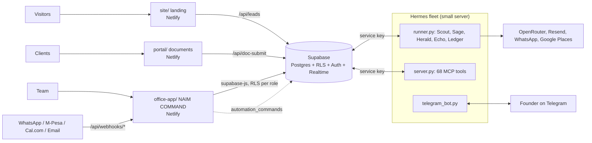

# Naim Automation Systems Co.

Three deployables in one repo, on **Netlify + Supabase only** (Cloudflare is fully removed), plus the Hermes automation fleet.

| Folder | What it is | Netlify base dir |
|---|---|---|
| `site/` | Landing page (white/gold, Before/After, Book Appointment form → Supabase `leads`) | `site` |
| `portal/` | Digital Document Portal. Step 1 Onboarding Guide, Step 2 Quotation & Agreement, e-signatures → Supabase `portal_submissions`, auto-filed into `documents` | `portal` |
| `office-app/` | **NAIM COMMAND**, the office app that runs the company (24 modules, React 19 + Supabase) | `office-app` |
| `mcp-server/` | Hermes fleet runner, FastMCP server (**68 tools**), Telegram cockpit, tests (Python) | not Netlify, runs on any small server |
| `hermes-fleet/` | Hermes persona (SOUL.md), 5 per-bot SOULs (`souls/`), SETUP.md, BRIEFING.md, config.yaml, Scout CSV sources | — |
| `supabase/` | `schema.sql` (45 tables, RLS, triggers, views, RPCs), `seed.sql` (demo data, purgeable), `tests/rls_test.py` | — |

## Architecture

The app sends commands (for example Trigger Enrichment) into `automation_commands`. The runner picks them up, does the work and writes back, and the app updates live.

## 1. Supabase (once)
1. Create a project at supabase.com.
2. In the SQL Editor, run `supabase/schema.sql`.
   - Optionally run `supabase/seed.sql` for demo data. Every demo row is flagged `is_demo`, so it can be removed later.
3. From Settings → API, copy three values:
   - **Project URL**
   - **anon key**, which goes in the office app
   - **service_role key**, which goes only in the Netlify Functions and `mcp-server`. Never put it in browser code.
4. Under Authentication → URL configuration, add your three Netlify URLs.

## 2. Netlify (import this repo three times)
| Site | Base directory | Build command | Publish directory | Environment variables |
|---|---|---|---|---|
| Landing | `site` | `npm run build` | `site/dist` | `SUPABASE_URL`, `SUPABASE_SERVICE_ROLE_KEY` |
| Portal | `portal` | `npm run build` | `portal/dist` | `SUPABASE_URL`, `SUPABASE_SERVICE_ROLE_KEY`, `SITE_URL` (landing URL) |
| Office app | `office-app` | `npm run build` | `office-app/dist` | `VITE_SUPABASE_URL`, `VITE_SUPABASE_ANON_KEY`, `VITE_PORTAL_URL` |

After the sites are live:
1. Sign up in the office app. **The first account becomes Owner.**
2. Assign roles to everyone else in *Roles & Permissions*. Permissions are enforced by Row Level Security in the database.
3. When you are ready to go live, go to *Settings → Data → Remove all demo data*.

## 3. Hermes fleet
See [`hermes-fleet/README.md`](hermes-fleet/README.md). In short, run `mcp-server/runner.py` on a small server with the Supabase service key. The buttons in the app then trigger real bot runs.

## NAIM COMMAND modules
- **Core**: Command Center, My Day, Lead Engine (funnel with conversion %, leads table, Actions panel with kill switch and threshold, Replies inbox, Campaigns), Deals kanban (moving a deal to Contract creates the 50/50 invoices), Clients with Customer 360 (Visits, Invoices, Memberships, Packages and more)
- **Delivery**: Appointments (list, calendar, queue, waitlist, Appointment 360 with Services/Notes/Timeline), Projects, Tasks, Documents
- **Sales and stock**: POS & Billing, Invoices (PDF), Services, Care Plans, Inventory, Purchases
- **Money**: Finance (cash flow, receivables ageing, payables, tax, day close), Expenses, Cash Till, Payroll (NSSF/SHIF/Housing/PAYE)
- **Team and admin**: Staff & HR (departments, shifts, attendance, leave), Reports, Hermes Fleet, Roles & Permissions, Settings

All modules support dark and light mode, with six colour palettes (Naim Gold is the default). Animations use GSAP and respect reduced motion. Side businesses are switchable from the top bar.

## Local development
```bash
cd site && npm install && npm run build
cd portal && npm install && npm run build
cd office-app && npm install && npm run dev   # needs VITE_SUPABASE_URL / VITE_SUPABASE_ANON_KEY in .env
```
`office-app/local-backend/` is a Supabase-compatible preview backend: PostgREST plus a small auth emulation over local Postgres. It is what powers the hosted preview. Do not deploy it.

## Tests
| What | Command |
|---|---|
| Per-role RLS (5 roles, every table) | `PSQL="psql $DATABASE_URL" python3 supabase/tests/rls_test.py` |
| All MCP tools | `cd mcp-server && .venv/bin/python scripts/test-tools.py` |
| Full business flow, lead to subscription | `cd mcp-server && .venv/bin/python scripts/e2e-flow.py` |
| Inbound webhooks | `cd office-app && node netlify/test-webhooks.mts` |

Run against a staging project, never production data. Each script removes its own test rows.

## Inbound webhooks (office-app Netlify functions)
`/api/webhooks/whatsapp`, `/api/webhooks/mpesa?token=…`, `/api/webhooks/booking` (Cal.com) and `/api/webhooks/email`. Secrets and setup are in `hermes-fleet/SETUP.md`.

## Security to-do
- Make this repository **private**. It contains client documents and a CV PDF.
- The old admin key `naim-admin-2026` is gone from the code, but it is still in git history. Treat it as burned.